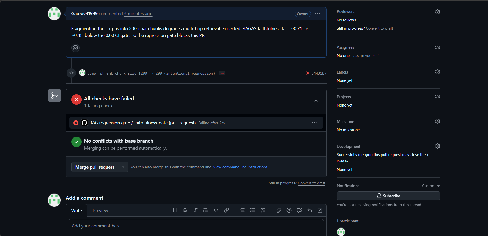

# v2 — CI regression gate

A pytest suite scores the golden set with the RAGAS judge on every PR; GitHub
Actions **blocks the merge** when mean faithfulness drops below the gate (0.60).

> Tag: `v2.0.0` · Phase P2 · builds on [v1](v1.md)

```bash
python -m pytest tests/test_regression.py -s -q     # ~30s, faithfulness only
```

- `tests/test_regression.py` — runs the real pipeline with the current config,
  scores RAGAS faithfulness over the full golden set, fails if the mean < gate.
  Self-explaining: each failing case prints its answer.
- `.github/workflows/ci.yml` — install → `python -m rag ingest` → gate, on every
  `pull_request` (and pushes to `main`). Needs an `OPENAI_API_KEY` repo secret.

---

## Why the gate uses RAGAS faithfulness, not DeepEval's

A finding worth stating plainly: **DeepEval and RAGAS define "faithfulness"
differently.** DeepEval only flags claims that *contradict* the retrieved
context; RAGAS flags claims that aren't *supported* by it. So DeepEval's
faithfulness is blind to a retrieval regression, while RAGAS's catches it —
measured on the same chunk-size change:

| `chunk_size` | RAGAS faithfulness | DeepEval faithfulness |
|---|---|---|
| 1200 (baseline) | **0.71** | 0.75 |
| 200 (regression) | **0.48** | 0.76 |

The corollary matters for eval design: **faithfulness alone can't catch a
retrieval regression** — you need a support-based judge (RAGAS) or a
recall/relevancy metric. The gate uses RAGAS faithfulness for exactly this
reason. (The [v3](v3.md) context-correctness layer attacks the same blind spot
from another angle.)

---

## The caught regression

[Demo PR #1](https://github.com/Gaurav31599/AutoRag-Eval/pull/1) shrinks
`chunk_size` 1200 → 200. RAGAS faithfulness falls from ~0.71 to ~0.48 — below
the 0.60 gate — so the **RAG regression gate** check goes red and the PR is
flagged as failing
([CI run](https://github.com/Gaurav31599/AutoRag-Eval/actions/runs/28753628637)):



> The gate runs the real pipeline with the PR's config (`ingest` → generate →
> score) — so the failure reflects the actual quality drop, not a lint rule.

**DoD:** a demo PR that changes chunk size, drops faithfulness, and is blocked
in CI. ✅

> To *hard-enforce* the block (prevent merge, not just show red), add a branch
> protection rule on `main` requiring the `faithfulness-gate` status check to
> pass. The check itself is the gate; branch protection is the enforcement knob.
